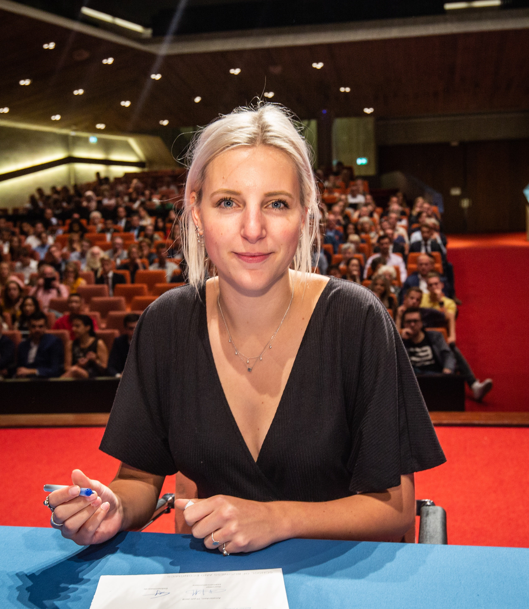

**Xu Lin (Student - Tinbergen MPhil in Economics)**

Being an intern at Data Science Hub was a very rewarding and fulfilling experience. During my internship I was able to work on the research topic that I found interesting. Through diving deeply into the Money Market Statistical Reporting data, I have gained practical knowledge about financial markets as well as better understanding on how to construct theoretical models in order to explain data patterns. This put the skills I developed in the university to the test and provided an insight into how theories work in the real world.
In addition to the improvement in technical skills, working at DNB also provided me with opportunities to communicate with experts in various fields of economics, finance and data science. Their newest research topics and project ideas provoked my interest in the application of data techniques in finance and had a positive influence on my career path.

The Data Science Hub provides an open workspace for every one, and the environment is lively and enjoyable. The colleagues are very nice and always willing to help. Besides working, DNB cares about work-life balance, and provides sports facilities and a fantastic dining hall serving tasty and healthy food. The internship is definitely one of the best experiences in my career path and academic life.

**Abstract**

This thesis analyses unsecured overnight interbank market lending activities as bilateral bargaining games between borrowers and lenders, with interbank rates as bargaining outcomes. Banks regard the central bank as the outside option and may face asymmetric information when bargaining. The efficiency of the bargaining outcomes depends on information completeness. A strategic bargaining model is introduced to explain the formation of interbank trades and various deal rates between different banks. In particular, banks’ information set and beliefs affect their strategies and consequently the bargaining results. The parameters of the model are calibrated using Money Market Statistical Reporting (MMSR) data collected on the basis of transaction-by-transaction data from a sample of euro area reporting agents.

Thesis: [Bilateral Bargaining in the Interbank
Market](research/Bilateral_Bargaining_XuLin.pdf)

**Emma de Haan (Student - Master Econometrics)**

My time at DNB has been extremely enjoyable. There are several reasons for this. First, the environment and the colleagues make the period in which you are writing your thesis, where you’d normally be by yourself,  much more engaging. Not only are there always colleagues which can help with technical problems, the atmosphere allows for discussions and interesting conversation. Second, the projects which you can work on could have practical implications for others. For example, as I started my literature research, I found the dataset to be not as present in the literature or in practice as it could be. One of the reasons for this lack of utilisation had to do with the data quality. The fact that I was at DNB — where there is always a demand for research with regards to the translation of data obtained from regulation — meant that I could try and fill this gap. By talking to several colleagues interested in the dataset from different departments and continuing on the work of others, I was actually able to present a methodology which in turn allowed others to extract information from the data. This translation from theory to practice was a unique experience from which I learned a lot, and means I cannot recommend the opportunity enough.

Thus, if you want to learn more about the practical relations between research and regulation, then an internship at DNB will be exactly what you are looking for.

**Abstract**

In my thesis, I use the data drawn from the European Market Infrastructure Regulation (EMIR), which is only available at the central banks and supervisors. Recent developments in the technical standards of EMIR have opened the doors for systemic – albeit limited – use, to establish and explore structural changes in the interest rate swap market in response to proposed legislation. My thesis attempts to establish these relations, and continues on the work of Ascolese et al. (2017) to systematically review the data quality. And, thus, aims to provide a methodology which will allow regulators to comprehensively and systematically use EMIR in the implementation of their respective mandates. Moreover, the thesis presents evidence that the clearing obligation has lowered the overall exposure, but has resulted in increased dependence on a limited number of counterparties. Moreover, the initial margin, calculated based on the International Swaps and Derivatives Association’s (ISDA) Standard Initial Margin Model (SIMM), exhibits procyclical effects in terms of substantial variation across time. However, the required levels to be posted appear to be limited relative to the gross notional.

Thesis: [The impact of EMIR: The structure, dynamics, and challenges found in the Dutch interest rate swap market](research/MasterThesis_EmmadeHaan.pdf)

**Bernard van den Boom (Data Scientist - De Nederlandsche Bank)**

During my internship at DNB I worked on over-the-counter derivatives data (EMIR), a market with a gross market value of $12.1 trillion ($12,100,000,000,000!). During my internship at DNB I was surprised by the expertise of many of the colleagues I worked with and their willingness to explain difficult concepts. The derivatives market is complex and provides a big data set. Coming from a Computer Science background, I am definitely not an expert on the matter or finance in general, but was able to learn a lot from various colleagues. 

In addition to knowledgeable colleagues, I really enjoyed the atmosphere within the Data Science Hub. My colleague interns came from a variety of studies, which provided different perspectives on subjects. Although we each worked on our own theses, it was nice to be able to work with the same data set with some of my colleagues as well as share code between us through our internal Gitlab.

All in all, I thoroughly enjoyed my internship at a unique institution and it even resulted a job at DNB!

**Abstract**
The surge in financial regulatory data over the last decade has led to a situation where it has become impossible to look at the data by hand. Therefore, it is important to be able to process the data in a structural manner, to facilitate central banks in their goal of ensuring financial stability. One aspect of this, is finding entities that show out of the ordinary behavior. We propose a supervised outlier detection method that uses probabilities from multiple One-vs-Rest gradient boosted models to detect outlying parties. To do this, we aggregate transaction-level data first. Then, we add both semantic features and propose using the relationships between parties in the data to produce network-based features. We find that in our case using network-based features only slightly increases performance. At the same time, using both types of features, we are able to process the data set to generate a list of outliers, which regulators can then take a closer look at.

Thesis: [Supervised Outlier Detection in Financial Regulatory Data](research/MSc_VandenBoom_v20180706.pdf)

<!-- 
 -->

**Robert van Ommeren (Supervisor - De Nederlandsche Bank)**
*TBC*

**Abstract**
*TBC*

Thesis: [title](research/Working Paper No. 619 Wang Van Lelyveld Schaumburg 2018.pdf)

<!--  -->

**Puja Chandrikasingh (XXX where?? XX)**
Thesis: [Trading behaviour of European banking groups: Influence of capital changes analyzed econometrically with machine learning](research/Chandrikasingh, Puja 11059842 MScETRICS.pdf)
*TBC*

**Abstract**
*TBC*

 -->

**Dieter Wang (PhD candidate VU/Tinbergen Institute)**

**Abstract**

Thesis: [Do information contagion and business model similarities explain bank credit risk commonalities?](research/Working Paper No. 619 Wang Van Lelyveld Schaumburg 2018.pdf)

[Back](https://imanvl.github.io/dsh/)
